# **¿Cómo crear una imagen personalizada en Docker? - Nginx**


## **¿Que es Nginx?:**

NGINX es un servidor web open source de alta performance que ofrece el contenido estático de un sitio web de forma rápida y fácil de configurar. Ofrece recursos de equilibrio de carga, proxy inverso y streaming, además de gestionar miles de conexiones simultáneas.

- Tiene Licencia BSD simplificada, pero también existe Nginx Plus. 
- Es multiplataforma
- Bastante usado por sitios web conocidos, como: WordPress, Netflix, Hulu, GitHub...

---

## **¿Para que sirven las imágnes personalizadas?**

---

## ***PARTE A***: Siguiendo la[ guía](https://github.com/maximofernandezriera/Ciberseguridad-PePS/blob/master/_posts/2021-01-12-nginx.md) que explicaremos paso a paso, deberéis replicar tanto el escenario propuesto como su solución.

Partiendo de que tenemos Docker instalado en nuestro sistema operativo o máquina virtual. 

1. **Instalamos la imagen de Nginx**:
   
   Para eso podemos elegir entre las distintas imágenes disponibles que hay en [DockerHub](https://hub.docker.com). 

   Se recomienda utilizar las imágenes oficiales, más descaragadas o recomendadas y con menos bugs reportados. 

   También se puede escoger entre instalar una versión específica o por defecto, instalar la última  versión disponible. Para el segundo caso el comando es:

        docker pull nginx
    
    Una vez descargada la imagen, se guarda en la memoria caché de docker. De manera que la próxima vez que queramos utilizarla no la tengamos que volver a descargar

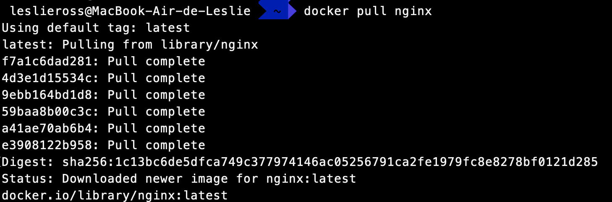

2. **Ejecutamos la imágen Nginx instalada:**
   
   Con este comando ejecutamos del contenedor como un `demonio (-d`, es decir, lo ejecuta en un segundo plano y de manera no interactuable. 
   
    publica el puerto 8080 en la red del host. También llamó web al contenedor usando la opción --name.


        docker run --rm -d -p 8080:80 --name web nginx
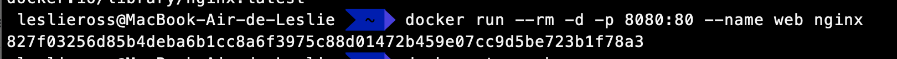

Y para poder comprobar su correcta descarga podemos visitar [http://localhost:8080](http://localhost:8080). En el cual nos aparecerá la página de bievenida por defecto de *Ngnix*


3.  **Personalizamos nuestra página**
   
    Para ello, antes debemos para nuestro contenedor llamado `web`.
    
        docker stop web
    
    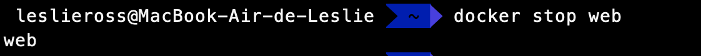

    Luego, desde el directorio en el que nos encontramos al inicializar la terminal, creamos los directorios *nginx > site-content* y nos posinionamos en este último. Para ello podemos utilizar las siguientes intrucciones:
    
    -   ***mkdir:*** + (nombre del directorio) sirve para crear direcctorios 
    -   ***cd:*** + (nombre del directorio al cual nos queremos mover)


    ```
    mkdir nginx
    cd nginx/
    mkdir site-content
    cd site-content/
    ```

    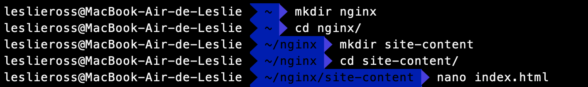

    A  continuación, agregamos nuetro HTML personalizado, con los diguientes comandos:

        nano index.html #para crear el archivo
        cat index.html #para editar el archivo

    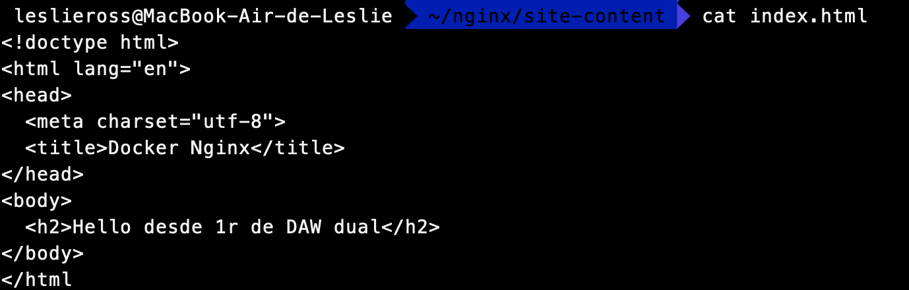

    Ahora ejecuta el siguiente comando, que es el mismo que el anterior, pero ahora agregamos la marca -v para crear un volumen. Esto montará nuestro directorio local ~/Documentos/nginx/site-content localmente en el contenedor en ejecución en: /usr/share/nginx/html

        docker run --rm -d -p 8080:80 --name web -v /Users/leslieross/nginx/site-content:/usr/share/ngnix/html nginx

        
    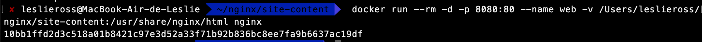

    Y este es el resultado:

    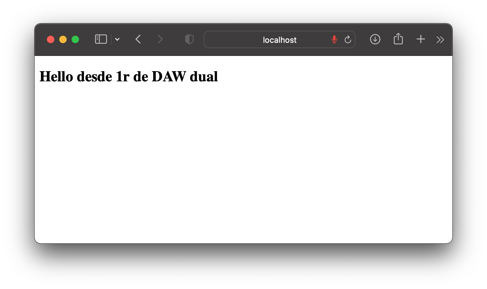


4.  **Creamos una imagen personalizada**
   
   Para crear una imagen personalizada, necesitaremos crear un Dockerfile y agregarle nuestros comandos.
   
   En el mismo directorio, crea un archivo llamado Dockerfile y pega los siguientes 
   comandos.

   ```docker
   FROM nginx:latest
   COPY ./site-content/index.html /usr/share/nginx/html/index.html
   ```

El comando **FROM** nos inidica que vamos a construir nuestra imagen personalizada usando la última imagen de nginx. Y luego construirá nuestra imagen personalizada encima de ella.

Y con el comando **COPY** indicamos que vamos a copiar nuestro archivo index.html en el directorio */usr/share/nginx/html* dentro del contenedor, sobrescribiendo el archivo index.html predeterminado proporcionado por nginx.

>Nota: No agregamos un ENTRYPOINT o un CMD a nuestro Dockerfile. Usaremos el ENTRYPOINT y el CMD subyacentes proporcionados por la imagen nginx.

Para construir nuestra imagen, ejecuta el siguiente comando:

    docker build -t webserver .

Este comando cuando se ejecuta indica a Docker los comandos que debe ejecutar ubicados en nuestro Dockerfile. Verás una salida similar en tu terminal a la siguiente:

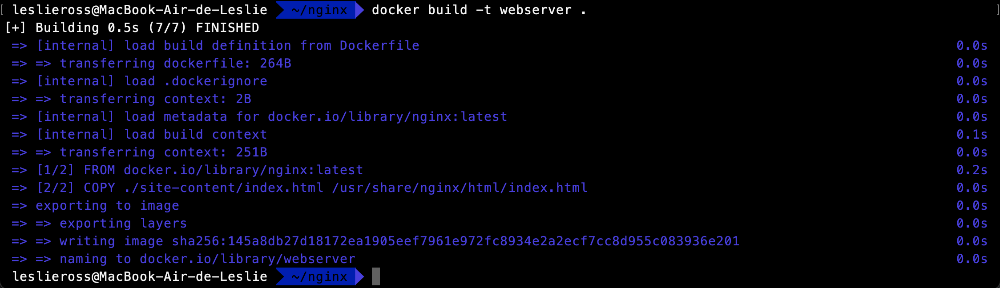

Ahora podemos ejecutar nuestra imagen en un contenedor, pero esta vez no tenemos que crear un volumen para incluir nuestro html pues ya lo hacemos en el Dockerfile al copiar el archivo.

    docker run --rm -d -p 8080:80 --name web webserver


*Basado en este [blog](https://www.docker.com/blog/how-to-use-the-official-nginx-docker-image/)*

---
---
<br/>

## ***PARTE B***: ¿Es posible publicar la web de pruebas mediante Microsoft Azure? Describe tu proceso de investigación?

Sí y continuación describiré el proceso.

1. ### **Creamos una máquina virtual en [*Azure*](https://azure.microsoft.com/es-es/free/students/)**
   
   Antes de todo, nos debemos crear una cuenta en el portal de *Microsoft Azure*. Sí lo vinculamos con nuestro email de estudiante podemos recibir 100$ gratis, para poder empezar a trabajar en nuestros proyectos. 

   >*Nota:* Durante el proceso es necesario hacer varias verificaciones de autentificación. Así que es recomendable disponer del móvil cerca.

    Una vez creada nuestra cuenta, accedemos a nuestro portal de Azure:


    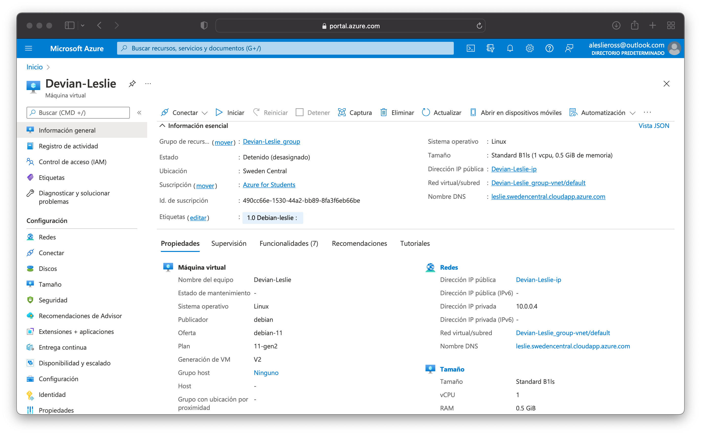

    >*Nota:* La creación de una máquina se puede de 3 maneras diferentes según su [documentación](https://docs.microsoft.com/es-es/azure/virtual-machines/windows/quick-create-portal). Y en esta guía se va explicar detalladamente el porcedimiento a través del portal.

    Luego, desde la página de inicio, accedemos a la pestaña de *máquinas virtuales* y luego le damos a *crear*
    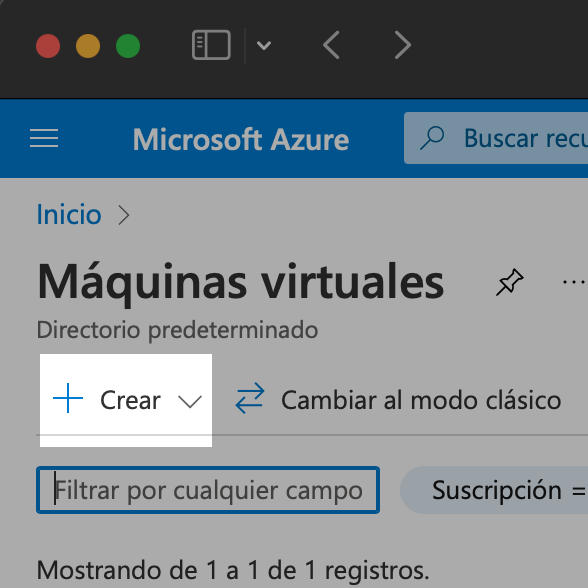

    A continuación nos aparecerá la pestaña de configuración para crear nuestra máquina virtual. Para poder aseguranos que la estamos creando correctamente, podemos seguir este pequeño [quickstart](https://docs.microsoft.com/es-es/azure/virtual-machines/linux/quick-create-portal).

    >*Nota:* Cuando llegues a la parte de escoger la ubicación de tu máquina recomiendo seleccionar el país de Suecia, puesto que allí podemos encontrar algunas máquinas con un precio muy barato. Y así aprovecharemos al máximo nuestro crédito gratuito. Para esta práctica va bien cualquier máquina sencilla.


2. ### **Conectamos con nuesta Máquina Virtual**
   
   En el panel de conexión de nuestra máquina virtual podemos Iniciar la VM para poder conectarnos a ella.
   
   En la parte de la información podemos observar que se muestra la IP Pública y un DNS que nos genera Azure para poder conectarnos a nuestra máquina ya sea por SSH o por HTTPS. Nosotros lo haremos mediante las claves SSH

   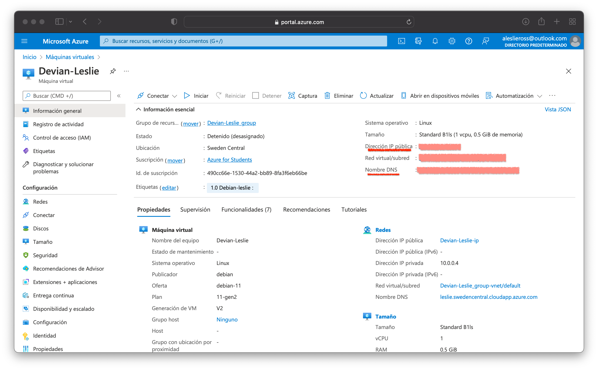

   Una vez hayamos conectado exitosamente con nuestra máquina virtual, debemos  instalar los recursos necesarios. Por ejemplo: docker y git. 
   
   Para hacer la conexión a la VM y la instalación de los recursos podemos utilizar esta [guía propia](https://github.com/LeslieR0SS/Dockerized-Gilded-Rose-en-una-VM-Microsoft-Azure),en el que se explica detalladamente los pasos a seguir.
   >*Nota:* Para hacer la conexión deberemos utilizar la terminal bash.

   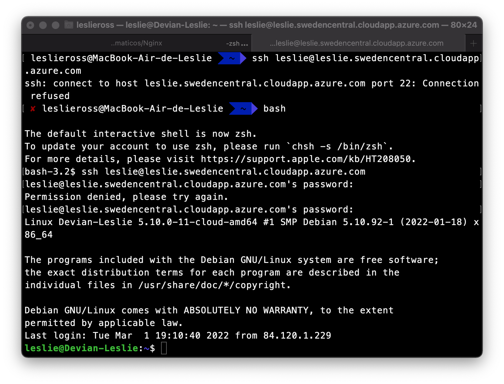
   
   Una vez ahí dentro instalaremos una imagen para nginx que hemos encontrado en el [*DockerHub*](https://hub.docker.com/search?q=cenicero&type=image) y va perfecta para esta práctica. Curiosamente esta imagen fue realizada por mi compañero [@dEzequiel](https://github.com/dEzequiel).

   La imagen que utilizaremos se llama [nginx-modify](https://hub.docker.com/r/cenicero/nginx-modify). Entonces, dentro de nuestra VM ejecutamos el siguiente comando:

    ```bash
    sudo docker pull cenicero/nginx-modify:latest
    ```
    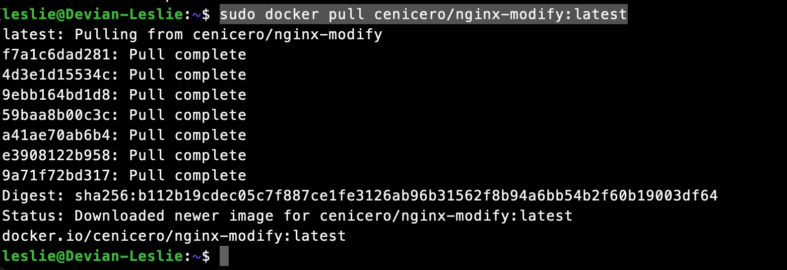

    A continuación ejecutamos el docker.

    ```bash
    sudo docker run --rm -d -p 8080:80 --name web cenicero/nginx-modify
    ```

    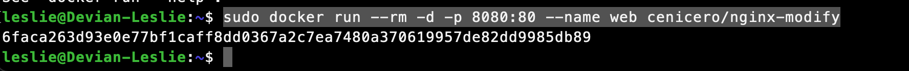

    Finalmente  si  hacemos una solicitud GET con curl desde la máquina virtual con el contenedor en ejecución, obtenemos el contenido index.html.


